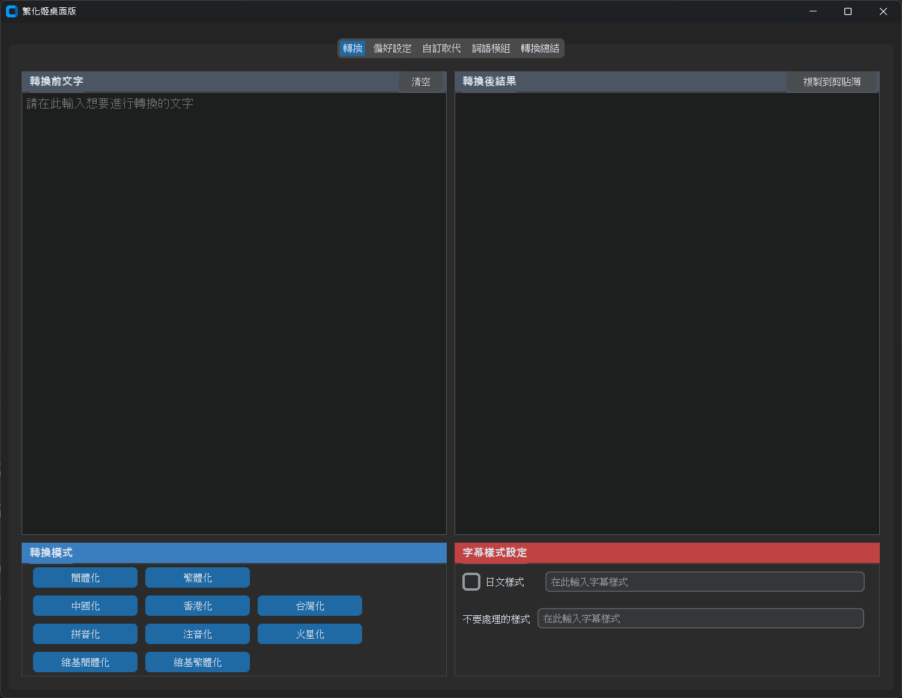

# 繁化姬桌面版 (Fanhuaji Desktop Client)

這是一個使用 Python 和 CustomTkinter 建立的「繁化姬」(zhconvert.org) 桌面應用程式。它透過呼叫官方提供的公開 API，實現了繁簡轉換與地區化詞彙轉換的核心功能，並提供了一個現代化、功能豐富的圖形化使用者介面。

本專案旨在提供一個原生、高效能的桌面體驗，讓使用者可以方便地在本地環境中使用繁化姬強大的轉換服務，並保存個人的常用設定。



---

## ✨ 主要功能

- **動態 UI 生成**: 應用程式啟動時會自動從 `service-info` API 獲取最新的轉換器與模組列表，確保功能與官方同步。
- **多樣化的轉換模式**: 支援包括簡體化、繁體化、台灣化、香港化、拼音化在內的所有官方轉換模式。
- **完整的偏好設定**: 提供了與官方網站幾乎完全一致的偏好設定選項，包括文本整理、差異比較、日文處理策略等。
- **強大的自訂取代**: 支援「保護字詞」、「轉換前取代」、「轉換後取代」三種模式，並提供美觀的 UI 介面。
- **精細的詞語模組控制**: 以表格形式清晰展示所有可用模組，並允許使用者為每個模組單獨設定「自動」、「啟用」或「停用」狀態。
- **詳細的轉換總結**: 轉換完成後，會在新分頁中展示詳細的轉換參數、使用的模組列表以及一個帶有顏色高亮的、像素級對齊的差異比較視窗。
- **設定持久化**: 能夠將「自訂取代」和「詞語模組」的設定儲存到本地檔案 (`zhconvert_settings.json`)，方便下次使用。

## 🛠️ 技術棧

- **Python 3**: 主要開發語言。
- **CustomTkinter**: 用於建立現代化的圖形使用者介面。
- **Requests**: 用於與繁化姬 API 進行網路通訊。
- **Pillow**: (CustomTkinter 的依賴項) 用於處理圖像。
- **pyperclip**: 用於實現「複製到剪貼簿」功能。

## 🚀 開始使用

請依照以下步驟來設定和執行本專案。

### 1. 前置需求

- 確認您的電腦已安裝 **Python 3.8** 或更高版本。
- 確認 Python 的套件管理器 `pip` 可正常使用。

### 2. 安裝步驟

```bash
# 1. (可選) 複製專案
# git clone https://github.com/bluehomewu/zhconvert_python_GUI.git
# cd zhconvert_python_GUI

# 2. (推薦) 建立並啟用虛擬環境
python -m venv venv
# Windows
.\venv\Scripts\activate
# macOS / Linux
source venv/bin/activate

# 3. 安裝所有必要的函式庫
pip install -r requirements.txt

# 4. 執行應用程式
python main.py
```

### 3. `requirements.txt`

請在您的專案根目錄下建立一個名為 `requirements.txt` 的檔案，並填入以下內容，以便快速安裝所有依賴：

```text
customtkinter
requests
pyperclip
```

## 📂 專案結構

本專案採用了模組化的結構，將不同功能的程式碼分離到獨立的檔案中，以提高可讀性和可維護性。

```
zhconvert_python_GUI/
├── main.py              # 應用程式的主進入點，負責啟動和載入
├── api_client.py        # 封裝所有與繁化姬 API 互動的網路請求
├── requirements.txt     # 專案依賴列表
├── .gitignore           # Git 忽略設定檔
└── ui/
    ├── __init__.py      #
    ├── main_window.py   # App 主視窗，負責組裝所有 UI 元件和處理核心邏輯
    └── tabs/
        ├── __init__.py
        ├── main_tab.py        # 「轉換」分頁的 UI
        ├── preferences_tab.py # 「偏好設定」分頁的 UI
        ├── replace_tab.py     # 「自訂取代」分頁的 UI
        ├── modules_tab.py     # 「詞語模組」分頁的 UI
        └── summary_tab.py     # 「轉換總結」分頁的 UI
```

## 🙏 致謝

- **繁化姬 (zhconvert.org)**: 感謝其開發者提供了如此強大且穩定的公開 API，使得這個專案成為可能。
  本程式使用了繁化姬的 API 服務，請參閱其 [繁化姬 說明文件](https://docs.zhconvert.org/) 以了解相關使用規範。
  繁化姬商用必須付費，請遵守其授權條款。

## 📄 授權

本專案採用 [Apache License 2.0](LICENSE) 授權。


## 📬 聯絡方式
如有任何問題或建議，歡迎透過 GitHub Issues 與我聯絡，或直接發送電子郵件至 [bluehome.wu@gmail.com](mailto:bluehome.wu@gmail.com)
本工具為個人開發與維護，歡迎任何形式的回饋與貢獻！
謝謝您的使用與支持！😊
